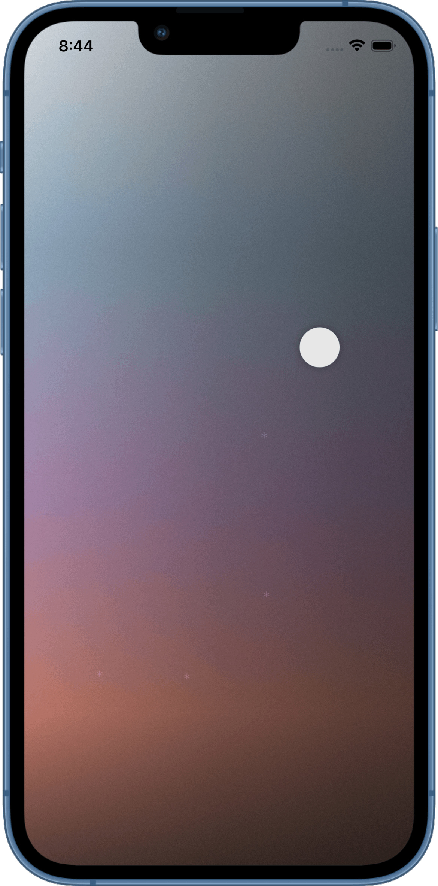

# Nod

A minimal iPhone/iPad sleep noise app. One view, no settings. Drag a dot to find a sound; tap anywhere to start or stop.

## UX

The view is a continuous 2D noise space.

- **X axis** — brightness. Left sweeps a low-pass filter down to ~350 Hz (dark). Right opens a high-pass filter up to ~150 Hz (bright). The middle is unfiltered full-spectrum noise.
- **Y axis** — noise color. Top is white noise; moving down crossfades through grey, pink, and brown via a biased triangle basis so the lower half of the grid gives more range to the darker, bass-heavy tones.

All four noise types (white, grey, pink, brown) loop simultaneously as pre-generated PCM buffers. A CADisplayLink smooths gain and filter changes at ~60 fps so dragging never causes audible clicks.

After sitting at a position for 15 minutes, the app saves it as a bookmark (up to 5). Bookmarks appear as faint asterisks. Dragging the dot over one triggers a haptic pulse.

## Technical notes

- **Audio graph**: four `AVAudioPlayerNode`s → per-channel mixers → sum mixer → HP EQ → LP EQ → main mixer
- **Buffer generation**: noise is generated once at startup on a background thread and cached; subsequent play/stop cycles reuse the same buffers
- **Audio session**: `.playback` category so audio continues when the screen locks; session only activates on first tap so the app doesn't interrupt other media
- **Engine lifecycle**: `AVAudioEngine` is started and stopped with each play/stop — not kept running silently — to minimize battery drain
- **Thread safety**: UI state (`isRunning`) toggles immediately on tap; a 50ms debounced task handles the actual engine start/stop so rapid taps don't race
- **Now Playing**: exposes play/pause/stop to Control Center and lock screen via `MPRemoteCommandCenter`

## Stack

Swift · SwiftUI · AVFoundation · iOS 17+

## Screenshot

